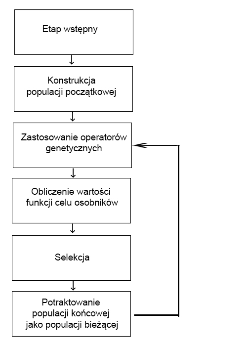

## Algorytmy genetyczne - małe przypomnienie

### Co to jest algorytm genetyczny?

Algorytmy genetyczne (z ang. Genetic Algorithms, GA) stanowią metodę rozwiązywania problemów, głównie zadań optymalizacyjnych. Oparte są na naturalnej metodzie ewolucji - przeżywają osobniki tylko najbardziej przystosowane do danego środowiska.

### Schemat działania



### Do czego wykorzystywane są algorytmy genetyczne?

Ogółem mówiąc:

-   szeregowanie zadań
-   konstrukcja strategii inwestycyjnych
-   modelowanie finansowe
-   optymalizacja funkcji
-   podejmowanie decyzji
-   minimalizacja kosztów
-   harmonogramowanie pracy

Ciekawe przykady zastosowań algorytmów genetycznych:

-   [Odtwarzanie obrazu Mona Lisy](https://www.youtube.com/watch?v=WAIdM07Nc7k)

-   [Znajdywanie najlepszej trasy wyścigu](https://www.youtube.com/watch?v=l8zqXeWLR78)

-   [Flappy Bird](https://www.youtube.com/watch?v=wOaUmCmdWFk)

# Przykład 1

```{r include=FALSE}
library(genalg)
```

PROBLEM PLECAKOWY:
Cel: wybór warzyw o jak największej ilości witaminy C z ograniczeniem łącznej kaloryczności do danej wartości.

```{r}
dataset <- data.frame(vegetables = c("carrot", "cucummber", "potato", "broccoli", 
    "bean", "tomato", "pepper"), vitaminC = c(8, 10, 10, 1, 2, 
    23, 144), calories = c(41, 16, 77, 34, 31, 17, 32))
```

```{r}
#Przykładowe rozwiązanie
chromosome = c(0, 0, 1, 1, 1, 0, 0)
cat("Choosen vegetables:",dataset$vegetables[chromosome == 1])
cat("\nCalories of choosen vegetables:",sum(dataset$calories[chromosome == 1]))
cat("\nVitaminC of choosen vegetables:",sum(dataset$vitaminC[chromosome == 1]))

```

```{r}
#Funkcja przystosowania
calorieslimit <- 100

evalFunc <- function(x)
{
    current_solution_vitaminC <- sum(dataset$vitaminC[x == 1])
    current_solution_calories <- sum(dataset$calories[x == 1])
    
    if (current_solution_calories > calorieslimit)  return(0)
    else return(-current_solution_vitaminC)
    #ZWRACANĄ WARTOŚĆ MUSIMY PRZEMNOŻYĆ PRZEZ -1, PONIEWAŻ PAKIET "genalg" DOMYŚLNIE POSZUKUJE MINIMUM, A       W NASZYM PRZYKŁADZIE POSZUKUJEMY MAKSIMUM FUNCKJI, DLATEGO TEŻ WYKRES EWOLUCJI JEST FUNKCJą              MALEJĄCĄ
}

```

```{r}
#Realizacja algorytmu genetycznego
GAmodel <- rbga.bin(size = 7, popSize = 200, iters = 50, mutationChance = 0.01, evalFunc = evalFunc)
cat(summary(GAmodel))

plot(GAmodel)

```

```{r}
#Najlepsze rozwiązanie
best_soluton=c(0, 1, 0, 0, 1, 1, 1 )

cat("Choosen vegetables:",dataset$vegetables[best_soluton == 1])
cat("\nCalories of choosen vegetables:",sum(dataset$calories[best_soluton == 1]))
cat("\nVitaminC of choosen vegetables:",sum(dataset$vitaminC[best_soluton == 1]))
```

# Przyklad 2

## Wybor cech dla sieci neuronowych

Biblioteki

```{r}
library(GA)
library(imager)
library(neuralnet)
```

Przygotowanie danych Uzywamy zestawu danych `iris`

```{r}
features = colnames(iris)[1:4]

ir <- iris
ir$setosa <- ir$Species == "setosa"
ir$virginica <- ir$Species == "virginica"
ir$versicolor <- ir$Species == "versicolor"

stand <- function(x) { (x - mean(x)) / (sd(x)) }
ir_std <- as.data.frame(lapply(iris[, c(1, 2, 3, 4)], stand))
ir_std <- data.frame(ir_std, ir[5:8])


sets <- sample(1:nrow(iris), 0.75 * nrow(iris))
train_ir <- ir_std[sets,]
test_ir <- ir_std[-sets,]
```

Funkcja dopasowania Tworzy ona siec neuronowa uczaca sie na danych cechach

```{r}
fit = function(x) {
  selected_features = features[x==1]
  if (length(selected_features) == 0)
    return(0)
  nn_ir <- neuralnet(as.formula(paste("setosa+versicolor+virginica ~", paste(selected_features, collapse = ' + '), collapse = '')), train_ir, hidden = 3, act.fct = "logistic", rep = 5, linear.output = FALSE, err.fct = "ce", threshold = 0.005)
  nn_ir_pred <- compute(nn_ir, test_ir[-5:-8])
  id <- apply(nn_ir_pred$net.result, 1, which.max)
  predicted <- c('setosa', 'versicolor', 'virginica')[id]
  return(sum(predicted == test_ir$Species) / nrow(test_ir))
}

```

Uzycie algorytmu genetycznego

```{r}
GA = ga(fitness = fit, type = 'binary', nBits = 4, maxiter = 10, popSize = 4, parallel = TRUE, maxFitness = 1)

```

Wynik

```{r}

print(features[GA@solution==1])

```

### Funkcja pojedynczej zmiennej

#### Funkcja, której chcemy znaleźć maksimum

```{r}
f <- function(x)  (x^2+3*x+2)*sin(2*pi*x*20)*sin(2*pi*x)
lbound <- -10
ubound <- 10
curve(f, from = lbound, to = ubound, n = 1000)
```

#### Algorytm genetyczny

```{r}
GA <- ga(type = "real-valued", 
         fitness = f, 
         lower = c(th = lbound), 
         upper = ubound
         )
summary(GA)
```

#### Zmiana wartości funkcji przystosowania względem ilości pokoleń

```{r}
plot(GA)
```

#### Wizualizacja znalezionego maksimum

```{r}
curve(f, from = lbound, to = ubound, n = 1000)
points(GA@solution, GA@fitnessValue, col = 2, pch = 19)
```

### Funkcja dwóch zmiennych

```{r}
f2 <- function(x1, x2)
{
  (1-x1)^2+100*(x2-x1^2)^2
}
```

```{r}
x1 <- x2 <- seq(-2, 2, by = 0.01)
rosen <- outer(x1, x2, f2)
```

#### Wizualizacja

```{r}
filled.contour(x1, x2, rosen, color.palette = bl2gr.colors)
```

#### Algorytm genetyczny

```{r}
GA <- ga(type = "real-valued", 
         fitness =  function(x) -f2(x[1], x[2]),
         lower = c(-2, -2), upper = c(2, 2), 
         popSize = 50, maxiter = 1000, run = 100)
summary(GA)
```

#### Zmiana wartości funkcji przystosowania względem ilości pokoleń

```{r}
plot(GA)
```

#### Wizualizacja znalezionego minimum

```{r}
filled.contour(x1, x2, rosen, color.palette = bl2gr.colors, 
  plot.axes = { axis(1); axis(2); 
                points(GA@solution[,1], GA@solution[,2], 
                       pch = 3, cex = 2, col = "red") }
)
```

### Bibliografia:

-   <https://mfiles.pl/pl/index.php/Algorytm_genetyczny>
-   <https://yadda.icm.edu.pl> › PTPS_1\_2008_Winiczenko
-   <https://www.r-bloggers.com/2012/08/genetic-algorithms-a-simple-r-example/>
-   <https://cran.r-project.org/web/packages/GA/vignettes/GA.html>
